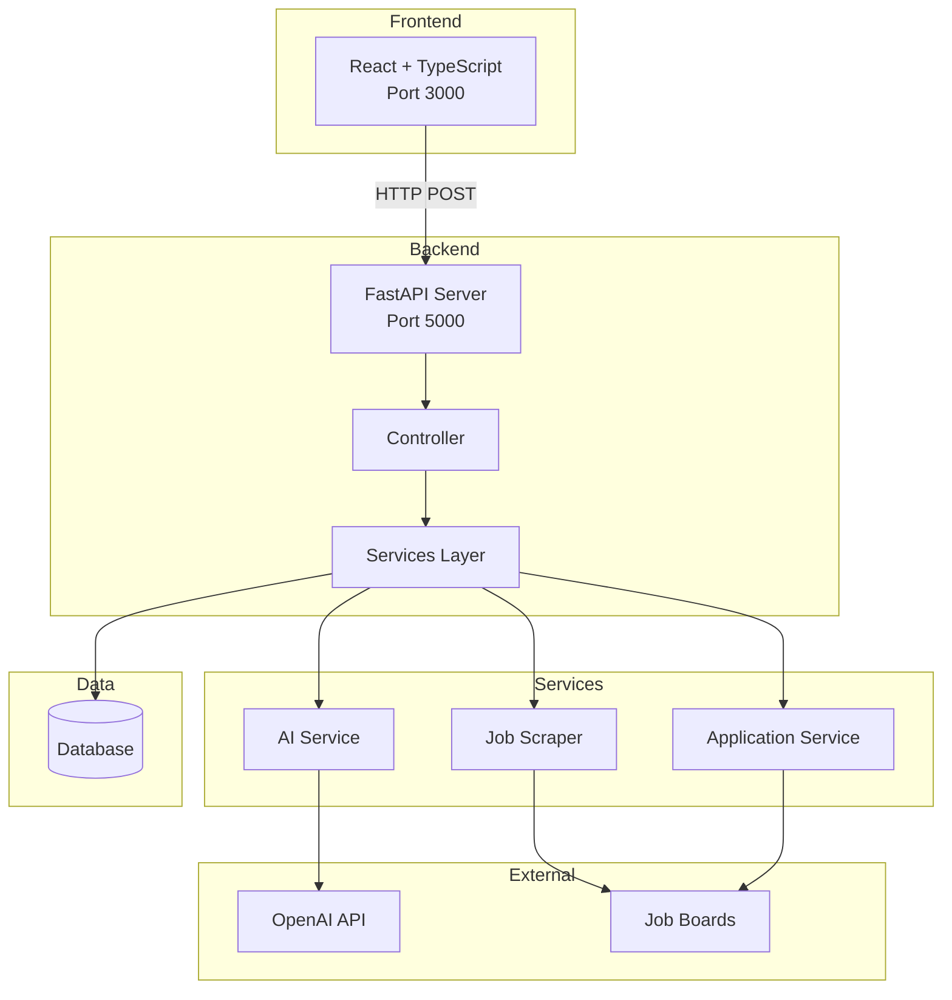
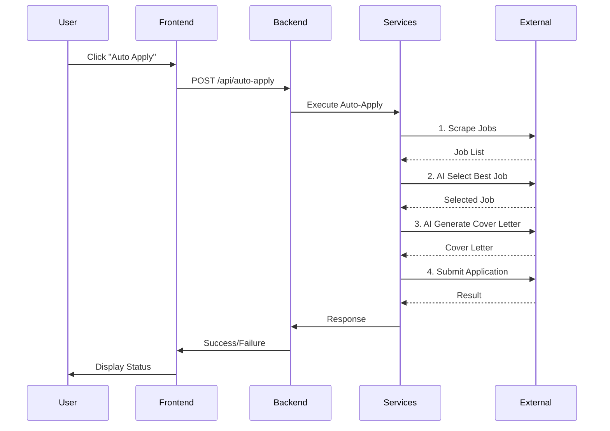
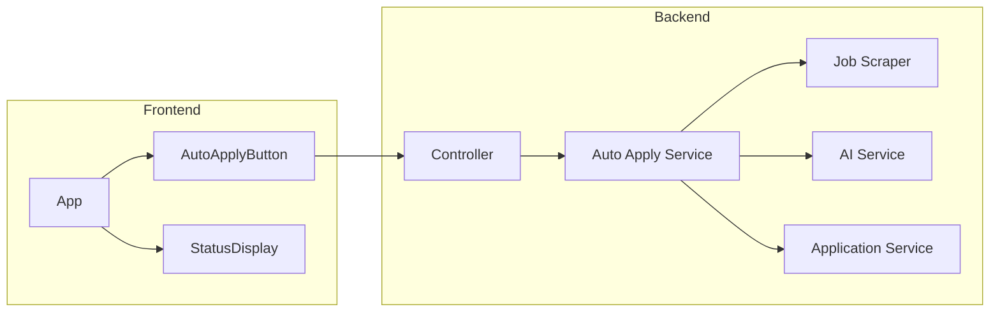
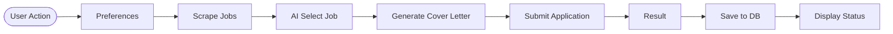

## 1. System Architecture

---

## 2. Auto-Apply Flow

---

## 3. Component Structure

---

## 4. Data Flow

---

## Technology Stack

- **Frontend**: React, TypeScript, Vite
- **Backend**: FastAPI, Python
- **AI**: OpenAI API
- **Database**: PostgreSQL
- **Architecture**: Layered (Presentation → API → Service → Data)
